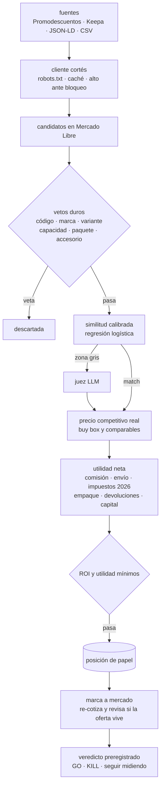

# escaner-arbitraje

Escáner de arbitraje entre **liquidaciones de retailers mexicanos** (Bodega Aurrera, Home Depot
MX, Costco MX, Amazon MX vía Keepa, Promodescuentos) y **Mercado Libre México**. Empareja cada
oferta con su publicación equivalente en ML y calcula la utilidad **neta** de revenderla:
comisión, envío, impuestos 2026, empaque, devoluciones y costo de capital — no el margen bruto
que hace ver rentable cualquier cosa.

**Estado: construido, probado y detenido a propósito.** 154 pruebas en verde, CI configurado,
todo corre offline. Nunca se conectó a datos reales por dos razones, y la primera es la que
importa: **con precios de liquidación realistas la tesis casi no sobrevive a los costos** — solo
2 de 11 ofertas legítimas pasan el filtro. La segunda es de acceso: Mercado Libre exige un
permiso de API que esta app no tiene, y los retailers grandes bloquean el acceso automatizado
(no se evaden protecciones; ver [Fuentes](#fuentes-qué-se-usa-y-qué-no)). Se dejó así en vez de
seguir construyendo sobre una hipótesis que la propia herramienta puso en duda.

## Qué demuestra este proyecto

| | |
|---|---|
| **Matar la propia tesis con datos** | El resultado central no es "encontré oportunidades", es "la brecha bruta del 30 % se evapora". Un descuento de 20–25 % queda en punto de equilibrio y hace falta 30–35 % para llegar al ROI mínimo. El número salió del propio motor de costos, no de una opinión. |
| **Emparejar sin identificador común** | El error caro no es perderse una oferta, es comprar el producto equivocado. Por eso la similitud de texto va **después** de vetos duros: código de barras, marca, capacidad, variante (Pro/Max/Note), generación, paquetes y accesorios. Medido contra 41 pares etiquetados a mano: **100 % de precisión** en todos los umbrales probados. |
| **Modelado económico completo** | Comisión, envío, retenciones fiscales 2026, empaque, reserva de devoluciones y costo de capital. Incluye una rareza real del mercado: el envío gratis obligatorio desde $299 hace la utilidad **no monótona** — vender a $298 deja más que vender a $305 — con una prueba que lo fija. |
| **Validación antes de arriesgar** | Cada oportunidad abre una posición de papel que se marca a mercado durante días, con regla GO/KILL escrita **antes** de ver los datos. Las estadísticas son las apropiadas para el problema: supervivencia (Kaplan–Meier) para cuánto vive una oferta, y bootstrap por bloques de día para los intervalos, porque las oportunidades del mismo día no son independientes. |
| **Recolección respetuosa** | Cliente HTTP que respeta `robots.txt` y los retrasos pedidos, con caché condicional, y que se detiene ante un bloqueo en vez de insistir. Los sitios que se defienden quedan fuera por política, no por incapacidad. |

### Resultados medibles

El emparejador, contra los 41 pares etiquetados (`escaner match-eval data/pares_etiquetados.csv`):

```
umbral  precision  recall     f1  n_pred
  0.85    100.00% 94.74% 97.30%      18
  0.90    100.00% 84.21% 91.43%      16
  0.95    100.00% 73.68% 84.85%      14
```

Precisión perfecta en todo el rango: nunca empareja un producto que no es. El recall baja al
subir el umbral, que es el intercambio correcto cuando el falso positivo cuesta dinero y el
falso negativo solo cuesta una oportunidad.

El pipeline completo, offline (`make demo`):

```
Ofertas vistas: 15 · en revisión: 1 · sin candidato útil: 4 · oportunidades: 2
```

Cuatro de los descartes son señuelos deliberados —una funda, un reacondicionado, un paquete de 2
y un modelo no-Pro contra un catálogo que solo tiene la variante Pro— y el emparejador los veta
por la razón correcta, no por casualidad. De las once ofertas legítimas sobreviven dos: LEGO
75301 con 26.2 % de ROI y una licuadora Oster con 17.7 %.

### Flujo



### Cómo contarlo

Guion de tres minutos con las preguntas que suelen seguir:
[`docs/GUION_ENTREVISTA.md`](docs/GUION_ENTREVISTA.md).

## La tesis (y el giro)

*Productos en liquidación se consiguen por debajo del precio competitivo de Mercado Libre por
más que el costo total de revenderlos.* Esa afirmación es fácil de creer y cara de confirmar mal:
una comisión de ~13-17.5 %, envío que paga el vendedor desde $299, retenciones de ISR/IVA (2.5 %
+ 8 % con RFC bajo el régimen de plataformas; 20 % + 16 % sin RFC) y el costo de tener capital
parado se comen una brecha bruta del 30 % hasta dejarla en cero — o negativa.

**Por eso este programa no vende nada primero: lo usa uno mismo.** Cada oportunidad que detecta
abre una **posición de papel** (una compra hipotética) y la marca a mercado durante varios días,
re-cotizando el precio competitivo real de ML y observando si la oferta de origen sigue viva.
Después de acumular muestra, una regla de decisión **preregistrada antes de ver datos** (no
ajustada para que salga bonita después) dice si hay evidencia para arriesgar capital real:

| Veredicto | Condición (≥ 30 posiciones marcadas en ≥ 10 días distintos) |
|---|---|
| **GO a capital real (pequeño)** | IC90 % de la utilidad por posición > 0 **y** vida mediana de la oferta > 6 h **y** oportunidades/semana × utilidad media ≥ meta mensual |
| **KILL** | IC90 % de la utilidad por posición < 0 |
| **Seguir midiendo** | El IC cruza cero o no hay muestra suficiente |

El papel NO mide: que la compra real se cancele, stock limitado por cliente, tiempo real de venta
(supone que vendes al precio competitivo de inmediato), devoluciones ni fraude. Por eso el
veredicto GO es "capital pequeño", nunca "escalar de inmediato". Detalle completo, con qué se
verificó en vivo y qué es supuesto de juicio experto: [`docs/ESPECIFICACION.md`](docs/ESPECIFICACION.md).

## Quickstart

```bash
make install   # venv + pip install -e .[dev]
make demo      # corre TODO offline: fixtures + MockTransport, sin red, sin credenciales
```

`escaner demo` monta 15 ofertas de retailer offline contra un catálogo falso de Mercado Libre y
corre el pipeline completo (emparejar → precio → utilidad → umbrales). Once son liquidaciones
legítimas con descuentos realistas (20–37 % bajo el precio competitivo de ML) y cuatro son
señuelos — una funda, un reacondicionado, un paquete de 2 y un no-Pro contra un catálogo que
solo tiene la variante Pro — que el emparejador veta por la razón correcta. **Solo 2 de las 11
sobreviven a los costos** (LEGO 75301 con ROI 26 %, licuadora Oster con 17.7 %): con comisión,
retenciones 2026, envío, devoluciones y capital, un descuento de ~20–25 % queda en cero o en
pérdida y hace falta ≥ 30–35 % para llegar al ROI mínimo. Esa es la lección que la demo tiene
que enseñar. Al final imprime un reporte de papel con historial simulado para mostrar cómo se
ve el veredicto.

## `escaner calc`: cómo impuestos y envío se comen el margen

Comprar a $1,500 y vender a $2,300 (peso 800 g) parece 53 % de margen bruto. Con el régimen de
plataformas (retención 2.5 % ISR + 8 % IVA, la opción normal para un vendedor con RFC e ingresos
bajo $300,000/año):

```
$ escaner calc --compra 1500 --venta 2300 --peso 800

  Precio de venta                            2,300.00
  Comisión ML (13.0% + fijo)                  -299.00
  Envío (vendedor)                             -62.00
  ISR                                          -49.57
  IVA                                         -158.62
  Compra (con IVA)                          -1,500.00
  Empaque                                      -15.00
  Reserva devoluciones                         -17.48
  Costo de capital                             -13.07
  Utilidad neta                                185.26

  ROI: 12.2%  ·  Margen: 8.1%

  Precio de equilibrio (utilidad = 0): $2,062.34
  Compra máxima para ROI 20% vendiendo a $2,300.00: $1,403.38
```

53 % bruto se convierte en **8.1 % neto**. Ahora el mismo cálculo **sin RFC** (retención
definitiva de 20 % ISR + 16 % IVA — lo que le pasa a quien vende sin darse de alta):

```
$ escaner calc --compra 1500 --venta 2300 --peso 800 --perfil sin_rfc

  ISR                                         -396.55
  IVA                                         -317.24
  ...
  Utilidad neta                               -320.35

  ROI: -21.1%  ·  Margen: -13.9%
```

La misma operación pasa de **+$185 a -$320** solo por el régimen fiscal. Un escáner que ignora
esto no está midiendo arbitraje: está midiendo qué tan generoso es su propio error de redondeo.

## Fuentes: qué se usa y qué no

Principio no negociable: **nunca evadir detección de bots** (CAPTCHA, WAF, rotación de IP,
huellas de headless falsas). Si un sitio bloquea, esa fuente deja de existir para este programa,
sin excepciones ni reintentos con otra identidad.

| Fuente | Uso |
|---|---|
| Promodescuentos (RSS) | Fuente principal del MVP, **uso personal** — sus términos prohíben reproducir el contenido en otro sitio; venderlo como SaaS necesita licencia aparte. |
| Keepa (Amazon MX) | API oficial de pago con llave propia del operador. |
| Bodega Aurrera / Home Depot MX / Costco MX | Solo la página de producto ya enlazada por una oferta, vía JSON-LD, respetando robots.txt y crawl-delay. Nunca se buscan productos ahí directamente. |
| CSV/JSON propio | Cualquier fuente sobre la que el operador ya tenga derecho a usar los datos. |
| Walmart MX, Liverpool, Coppel | **Nunca.** Bloqueo confirmado (CAPTCHA/WAF/timeouts); están en una lista negra dura en `http.py` que ni intenta pedirles robots.txt. |

## Configuración

Copia `.env.example` a `.env` y ajusta lo que aplique (prefijo `ESCANER_`). Lo mínimo para usar
fuentes reales es autorizar tu propia cuenta de Mercado Libre — **casi todos los endpoints que
importan devuelven 403 sin token** (verificado en vivo, ver `docs/ESPECIFICACION.md` §2):

```bash
escaner auth-url                 # abre esta URL en tu navegador y autoriza tu cuenta
escaner auth-code EL_CODE_QUE_TE_DIO_ML
escaner scan --source promodescuentos --limit 30
escaner paper mark                # re-cotiza las posiciones abiertas
escaner paper report               # veredicto + estadísticas
```

## Comandos

| Comando | Qué hace |
|---|---|
| `escaner demo` | Todo offline (fixtures + MockTransport): tabla de oportunidades + reporte de papel simulado. |
| `escaner scan --source {promodescuentos,keepa,csv} [--csv ruta] [--limit N]` | Corre una fuente real (requiere token de ML). |
| `escaner calc --compra X --venta Y [--categoria] [--peso] [--perfil] [--tipo] [--reputacion]` | Desglose de utilidad neta, precio de equilibrio y compra máxima para 20 % ROI. |
| `escaner match "título A" "título B" [--ratio]` | Puntúa si dos títulos son el mismo producto. |
| `escaner match-eval pares.csv` | Calibra los pesos del matcher y evalúa precisión/recall por umbral. |
| `escaner paper mark` / `escaner paper report` | Marca a mercado / imprime el veredicto preregistrado. |
| `escaner auth-url` / `escaner auth-code CODE` | Flujo OAuth de Mercado Libre. |
| `escaner init-db` | Crea o migra la base sqlite. |

## Limitaciones (léelas antes de confiar en un número)

- **Comisión y envío son estimados por tabla si no hay token de ML** (`fee_source`/`shipping_source`
  en cada desglose lo dice explícitamente). Con token, `ApiFeeModel`/`ApiShippingModel` cotizan
  contra `listing_prices`/`shipping_options/free` de verdad.
- **Promodescuentos es solo para uso personal** — no reproducir su contenido en un producto que
  se venda a terceros sin licencia. Además, su `<link>` casi siempre apunta al hilo de
  Promodescuentos, no a la página del retailer, así que el enriquecimiento JSON-LD rara vez
  aplica a esta fuente.
- **El papel no mide** cancelaciones de compra, stock limitado por cliente, tiempo real de venta,
  devoluciones ni fraude — por diseño (ver "La tesis" arriba). El GO es siempre "capital
  pequeño".
- **`sold_quantity` es una señal débil**: Mercado Libre lo volvió "referencial" (rangos) desde
  abril 2025; se usa como promedio informativo, nunca como filtro duro.
- La tabla de envío por peso solo tiene el primer tramo (≤ 0.3 kg) verificado contra una fuente
  oficial; el resto son estimaciones que conviene reemplazar con datos propios o con la API.

## Roadmap

La visión de más plazo es integrar este escáner al **"sistema operativo del vendedor"**: la
misma cuenta de ML que aquí se autoriza para detectar oportunidades sirve para el copiloto de
reclamos/postventa (otro proyecto), compartiendo cliente OAuth, modelos de comisión/envío y la
capa de persistencia — un vendedor no debería tener que autorizar su cuenta dos veces ni pagar
dos veces el costo de aprender la API de Mercado Libre.

## Desarrollo

```bash
make install    # crea .venv e instala -e .[dev]
make test       # pytest
make lint       # ruff check
make fmt        # ruff format
make demo       # escaner demo
```

Arquitectura y decisiones de diseño: [`docs/ARQUITECTURA.md`](docs/ARQUITECTURA.md). Operación
(autorizar ML, cron/launchd, cuándo decidir GO/KILL): [`docs/OPERACION.md`](docs/OPERACION.md).
